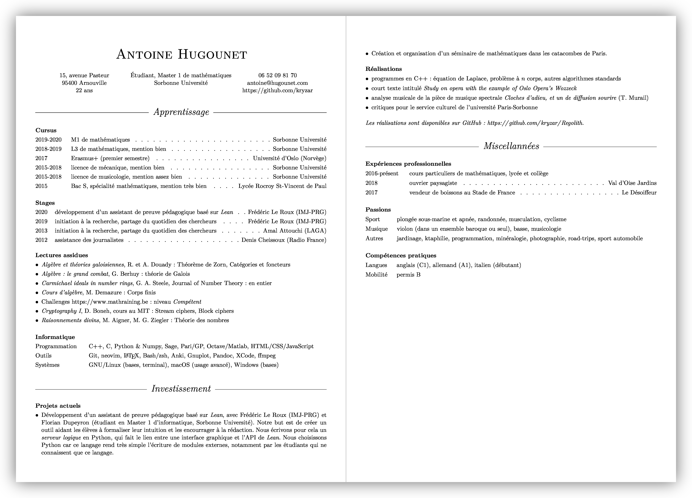

# LoLaTeXcv, a curriculum vitae template for LaTeX

LoLaTeXcv is another curriculum vitae template for LaTeX. It comes as a single file class. This one is best suited for students who mainly need to write lists. 



## Installation
### The easy way

1. Download the [LoLaTeXcv.cls](LoLaTeXcv.cls) file and put it in the directory where your resume is.

### The smart way
If you have multiple resumes using this class, it can be very painful to have a copy of [LoLaTeXcv.cls](LoLaTeXcv.cls) in each directory. The best solution is to have a *unique* copy of this file in the right place, this right place being `TEXINSTALLATIONDIRECTORY/tex/latex/base/LoLaTeXcv/`, according to the mighty [*LaTeX Wikibook*](https://en.wikibooks.org/wiki/LaTeX/Installing_Extra_Packages#Installing_a_package). So, follow these steps.

1. Locate your LaTeX installation directory.
	- If you're using MacTex on macOS, it's `Users/USERNAME/Library/texmf/` ;
	- If you're on Unix-type systems, it's `~/texmf/` ;
	- If you're on Windows, run `kpsewhich -var-value=TEXMFHOME$` in a terminal, and the directory is displayed.
2. Go to the LaTeX installation directory we just located.
3. If they do not exist, create the sub-folders `tex/latex/base/`.
4. Open a terminal session in this folder and run `git clone https://github.com/kryzar/LoLaTeXcv`. 

## Usage
### Getting started

Once you successfully installed LoLaTeXcv.cls, open your resume, and simply call the `LoLaTeXcv` class and your favorite encoding options. You don't need any other package. Then, begin the document. This is what your file should look like.
```latex
\documentclass{LoLaTeXcv}
\includepackage[T1]{fontenc}
\includepackage[utf8]{inputenc}

\begin{document}


\end{document}
```

To display your name and personal information such as your address, phone number, email address and god knows what, use the `lltxPersonalInfo` command right after `\begin{document}`. The first argument **must** be your name. The three remaining arguments are displayed as followed.


```latex
\documentclass{LoLaTeXcv}
\includepackage[T1]{fontenc}
\includepackage[utf8]{inputenc}

\begin{document}

\lltxPersonalInfo{
	Your Name}{
	Stuff on the left}{
	Stuff in the center}{
	Stuff on the right}

% content goes here

\end{document}
```


This command should be used once, and only once. You may now use the other commands and environments! Each command or environment begins with the prefix `lltx`. They are *all* listed and explained here. See [my own CV](Example.tex) for a real life example.

### lltxHistory
```latex
\begin{lltxHistory}{Section title}
	\item[Item title] item description \lltxdotfill Additional info
	% more items
	% or 
	\item[Item title] item description % and no \lltxdotfill and Additional info
\end{lltxHistory}
```

This environment is best suited for education and employment history. Here is an example from my own resume.

```latex
\begin{lltxHistory}{Cursus}
	\item[2019-2020] M1 de mathématiques \lltxdotfill Sorbonne Université
	\item[2018-2019] L3 de mathématiques, mention bien \lltxdotfill Sorbonne Université
	\item[2017] Erasmus+ (premier semestre) \lltxdotfill Université d'Oslo (Norvège)
	\item[2015-2018] licence de mécanique, mention bien \lltxdotfill Sorbonne Université
	\item[2015-2018] licence de musicologie, mention assez bien \lltxdotfill Sorbonne Université
	\item[2015] Bac S, spécialité mathématiques, mention très bien \lltxdotfill Lycée Rocroy St-Vincent de Paul
\end{lltxHistory}
```


The downside is that we manually have to write `\lltxdotfill` in each item. The plus side is that this environment is very adaptive and can be used without `\lltxdotfill`, for example by presenting your content as a list of subsections. This is what I do for computer skills.

```latex
\begin{lltxHistory}{Informatique}
	\item[Programmation]C++, C, Python \& Numpy, Sage, Pari/GP, Octave/Matlab, HTML/CSS/JavaScript
	\item[Outils]Git, neovim, \LaTeX, Bash/zsh, Anki, Gnuplot, Pandoc, XCode, ffmpeg
	\item[Systèmes]GNU/Linux (bases, terminal), macOS (usage avancé), Windows (bases)
\end{lltxHistory}
```


### lltxItemize

```latex
\begin{lltxItemize}{Section title}
	\item item description
	% more items
\end{lltxItemize}
```

This is just a slightly modified `itemize` environment. This one has a title, uses bullets as symbols and has no indentation. That's basically it. I use it for… lists. As an example, here is the list of mathematics books I read outside of my degrees.

```latex
\begin{lltxItemize}{Lectures assidues}
	\item{\textit{Algèbre et théories galoisiennes}, R. et A. Douady : Théorème de Zorn, Catégories et foncteurs}
	\item{\textit{Algèbre : le grand combat}, G. Berhuy : théorie de Galois}
	\item{\textit{Carmichael ideals in number rings}, G. A. Steele, Journal of Number Theory : en entier}
	\item{\textit{Cours d'algèbre}, M. Demazure : Corps finis}
	\item{Challenges https://www.mathraining.be : niveau \textit{Compétent}}
	\item{\textit{Cryptography I}, D. Boneh, cours au MIT : Stream ciphers, Block ciphers}
	\item{\textit{Raisonnements divins}, M. Aigner, M. G. Ziegler : Théorie des nombres}
\end{lltxItemize}
```


### lltxTitle

```latex
\lltxTitle{Big section title}
```

This is where the fun begins. This simple command was created to divide my CV into big sections : *Learning*, *Involvement* and *Miscellanea*. It is optional and should be used carefully. Use it because it is relevant, not because it is sexy. This is how it is displayed.


See my CV to view the result "in the text".

### Notes

- `\url` commands are displayed in the same font as the document and not in the ugly mono font.
- I created `\lltxdotfill` because the space between consecutive dots in `\dotfill` was too short ; you can adjust this space in [the class file](LoLaTeXcv.cls). If you do not like dots, you can use `\hfill` instead of `lltxdotfill` to have a blank space, or any other "filling" command. 

### Warnings

- If you need more sophisticated sections, such as a complex employment history, I suggest you give [Trey Hunner's *resume* class](https://github.com/treyhunner/resume) a shot. 
- Avoid line jumps in `lltxHistory`, the alignments will be miserable. If you find a better implementation of `lltxHistory` for the same graphical result, e.g. one that would allow line jumps in the *item description* while still having the *Additional info* on the top right of the item, please contact me or make a pull request so you can contribute.

## Authors
- Antoine Hugounet : myself, creator of this repo.

## License

This project is licensed under the GNU General Public License v3.0 - see the [LICENSE.md](LICENSE.md) file for details

## Acknowledgements
- [Florian Dupeyron](https://github.com/fdmysterious) for his numerous advices and the gigantic quantity of time he spent helping me on various projects, including this one.
- Lola Lanier for helping me correcting many typos and giving her wonderful name to this template.
- John Frusciante for his [voice](https://youtu.be/bFLs9mi6TK0?t=215) and [music](https://www.youtube.com/watch?v=-G2n6UqOWIo).
